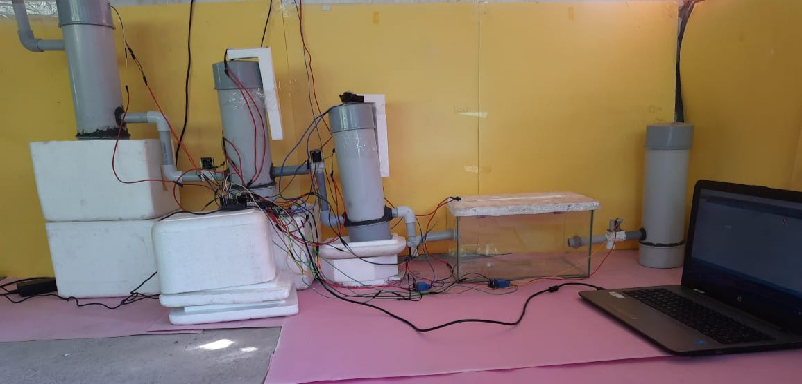
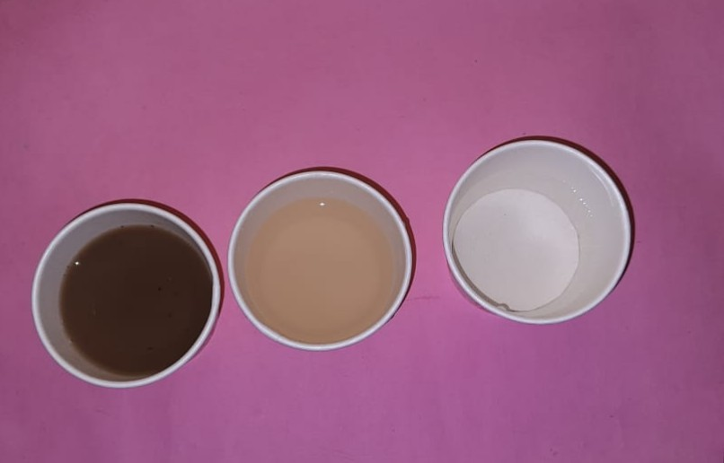

# sewage water treatment plant for pisciculture
 * The mini project in ***Semester 5*** 
 * Electronics And Instrumentation Engineering ***FISAT(Federal Institute Of Science And Technology)***

 

 

* Mentor : ***Mrs. Sreevidya P Menon*** 

* Our Team :  
***Reshma R*** 
***Kiran raju*** 
***Nithin Krishnan A*** 
***Aswanth k*** 

## ***_Description_***

_

## ***_Components & Tools :_***

## ***Hardware***  

&nbsp;&nbsp;&nbsp;&nbsp;&nbsp;&nbsp;&nbsp;&nbsp;&nbsp;&nbsp;&nbsp;
 &nbsp;&nbsp;&nbsp;&nbsp;&nbsp;&nbsp;&nbsp;&nbsp;&nbsp;&nbsp;&nbsp;
 &nbsp;&nbsp;&nbsp;&nbsp;&nbsp;&nbsp;&nbsp;&nbsp;&nbsp;&nbsp;&nbsp;
&nbsp;&nbsp;&nbsp;&nbsp;&nbsp;&nbsp;&nbsp;&nbsp;&nbsp;&nbsp;&nbsp;
&nbsp;&nbsp;&nbsp;&nbsp;&nbsp;&nbsp;&nbsp;&nbsp;&nbsp;&nbsp;&nbsp;
&nbsp;&nbsp;&nbsp;&nbsp;&nbsp;&nbsp;&nbsp;&nbsp;&nbsp;&nbsp;&nbsp;
&nbsp;&nbsp;&nbsp;&nbsp;&nbsp;&nbsp;&nbsp;&nbsp;&nbsp;&nbsp;&nbsp;
&nbsp;&nbsp;&nbsp;&nbsp;&nbsp;&nbsp;&nbsp;&nbsp;&nbsp;&nbsp;&nbsp;
&nbsp;&nbsp;&nbsp;&nbsp;&nbsp;&nbsp;&nbsp;&nbsp;&nbsp;&nbsp;&nbsp;
&nbsp;&nbsp;&nbsp;&nbsp;&nbsp;&nbsp;&nbsp;&nbsp;&nbsp;&nbsp;&nbsp;
 &nbsp;&nbsp;&nbsp;&nbsp;&nbsp;&nbsp;&nbsp;&nbsp;&nbsp;&nbsp;&nbsp;
 
  
  
  * ***Arduino UNO***  
* ***L298N motor drive*** 
* ***12v Dual channel Relay*** 
* ***Solenoid valve*** 
* ***Water Level Sensor*** 
* ***UV lamp***  
* ***dc motor*** 
* ***12v 3A DC power supply Adapter*** 
* ***paddle wheel*** 
* ***pvc, glass tank, mesh*** 

 

## ***Software*** 

   
 
 * ***Arduino IDE***  

 

## Block Diagram

## System Model

## ***_Video  :_***  
* https://drive.google.com/file/d/1zjX1BUXZ--mYbsP6enUF3Go-c3uxVYat/view?usp=sharing

## Output

